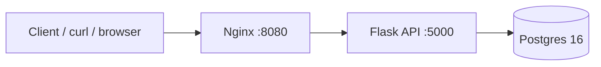

# notes-api
# notes-api

A small containerized notes API. Flask + Postgres + Nginx, orchestrated with Docker Compose. Built as a hands-on foundation for infrastructure and security projects to come.

## Architecture



Three services in one `docker compose up`:
- **Nginx** — reverse proxy, single entry point on port 8080
- **Flask** — API served by Gunicorn, runs as a non-root user, uses parameterized SQL queries
- **Postgres 16** — persistent storage on a named Docker volume

## Run it

```bash
docker compose up --build
```

Test the endpoints:

```bash
# Health check
curl http://localhost:8080/health

# Create a note
curl -X POST http://localhost:8080/notes \
  -H "Content-Type: application/json" \
  -d '{"title":"hello","body":"world"}'

# List notes
curl http://localhost:8080/notes
```

Tear it down:

```bash
docker compose down       # keep data
docker compose down -v    # also delete the Postgres volume
```

## Endpoints

| Method | Path      | Body                          | Description       |
|--------|-----------|-------------------------------|-------------------|
| GET    | `/health` | —                             | Health check      |
| GET    | `/notes`  | —                             | List all notes    |
| POST   | `/notes`  | `{"title": "...", "body":"..."}` | Create a note   |

## Security choices baked in

- **Non-root container user** — the Flask container runs as `appuser`, not root.
- **Parameterized SQL queries** — no string concatenation on user input, so no SQL injection.
- **Specific image tags** — `python:3.12-slim`, `postgres:16-alpine`, `nginx:1.27-alpine`. No `:latest`.
- **Secrets via environment variables**, not baked into images.
- **DB is internal-only** — Postgres is not exposed to the host. Only the app container reaches it; only Nginx is publicly reachable.

## What I learned

- Multi-container app design with `docker-compose`
- Service discovery via Compose's built-in DNS (services address each other by name: `db`, `app`, `nginx`)
- Health checks + `depends_on: service_healthy` to avoid the "app starts before DB is ready" race
- Reverse-proxy patterns with Nginx (`proxy_pass`, forwarded headers)
- Persistent state with named volumes (containers can be destroyed, data survives)

## What's next

- CI pipeline via GitHub Actions: lint → test → build image → scan (Trivy, Gitleaks) → push
- Deploy to AWS with Terraform (VPC, ECS, RDS)
- Kubernetes manifests + local deploy to k3s or minikube
- Full DevSecOps pipeline: Semgrep (SAST), Checkov (IaC scanning), image signing with Sigstore

## Related

- [devops-hale](https://github.com/halemaa/devops-hale) — DevOps study notes
- [cybersec-hale](https://github.com/halemaa/cybersec-hale) — Cybersecurity study notes